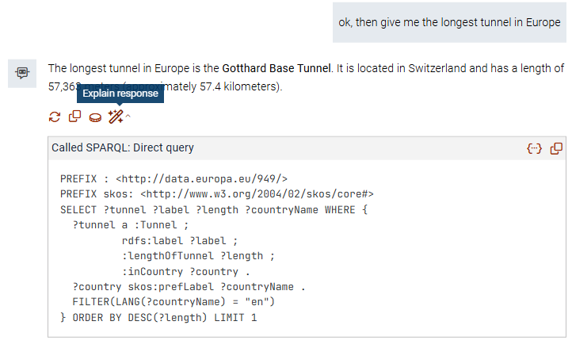
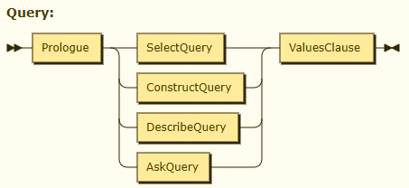
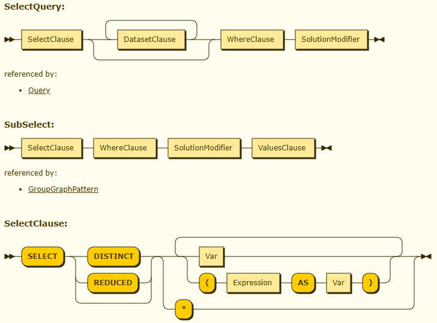

# RailDataForum2025 SPARQL Tutorial

## Intro

[RailDataForum2025](https://www.era.europa.eu/agenda/agenda-rail-data-forum-2025) offers 3 "SPARQL for Beginners" sessions:
- June 11 9:30-10:30 and June 12 13:30-15:15 (a longer session of 1:45h).
- This will be led by Vladimir Alexiev, chief data architect of Graphwise/Ontotext.
- I assume some basic knowledge of the RDF graph model and the Turtle format (serialization),
  since SPARQL patterns are based on the same syntax.
- You can follow this by a "Practical Data Consumption" session that will be led by Ghislain Atemezing of ERA.

We will explain the basics of SPARQL, 
show some queries (competency questions), 
and an `ERAbot` chatbot that can generate SPARQL.

### SPARQL eLearning

The [Ontotext Academy](https://academy.ontotext.com/welcome.html) has a "GraphDB Knowledge Graph Engineer" learning path.
Note: GraphDB is replacing Virtuoso as the semantic database of the ERA KG, 
but we use only standard SPARQL 1.1, so your skills will be transferable.
The academy is free, you just need to register with your email.

That learning path has 3 courses:
- Course 1: Introduction to Semantic Technologies
- Course 2: Semantic models with GraphDB
- Course 3: SPARQL

Normally the 3 courses need to be taken in sequence, and we highly recommend it if you have no experience with semantic technologies
or want to get a certificate.

If you want to take only the SPARQL course, please register and then contact [bob.ducharme@graphwise.ai](mailto:bob.ducharme@graphwise.ai).
Bob is the author of the famous [Learning SPARQL](https://www.learningsparql.com/) book that you can buy on [Amazon](https://www.amazon.com/Learning-SPARQL-Querying-Updating-1-1/dp/1449371434/) in paper or Kindle format.

### ERA KG Intro

- Virtuoso
  - [SPARQL editor](https://data-interop.era.europa.eu/endpoint): uses YasGUI, has syntax highlighting and autocompleting
  - [SPARQL endpoint](https://data-interop.era.europa.eu/api/sparql): API for posting queries
- GraphDB
  - http://rail.sandbox.ontotext.com/sparql : SPARQL editor. User `rdf2025`, password `Gr@phwise2025`
  - This is slightly older than the Virtuoso endpoint as it uses the ERA KG mentioned next; 
    but it has a chatbot.
- [ERA KG on Zenodo](https://zenodo.org/records/14605744) (Jan 6, 2025)
- [RINF data stories](https://data-interop.era.europa.eu/data-stories) (competency questions, see [source](https://github.com/Interoperable-data/ERA_vocabulary/tree/main/queries)): 
  you can select and execute them directly in Virtuoso, or copy from source and execute in GraphDB
- [Current ontology 3.0.1](https://data-interop.era.europa.eu/era-vocabulary/v3-20240618/) of 2024-06-18 (see [source](https://github.com/Interoperable-data/ERA_vocabulary)):
  - [Ontology diagram](https://data-interop.era.europa.eu/era-vocabulary/v3-20240618/#desc), reproduced below
  - [SKOS thesauri](https://data-interop.era.europa.eu/era-vocabulary/v3-20240618/skos/index.html) (enumeration values)
  - Note that ERA KG also uses SKOS taxonomies from the Publications Office,
    in particular http://publications.europa.eu/resource/authority/country
- [Future ontology 3.1.1](https://data-interop.era.europa.eu/era-vocabulary/) of 2025-05-12 (see [source](https://gitlab.com/era-europa-eu/public/interoperable-data-programme/era-ontology/era-ontology))
  - (Infrastructure Managers have a year to start submitting RINF data in accordance with this new version)

Ontology diagram of version 3.0.1:


We'll work with these main objects:
- `OperationalPoint`: any location for train service operations, or any location at boundaries between Member States or infrastructure managers. Includes station, stop, switch point, etc
- `SectionOfLine`: part of line between adjacent operational points; may consist of several tracks; cannot diverge
- `Tunnel`: a railway tunnel

You can learn more by reading the ontology documentation, but mind you it's pretty big!

### ERAbot

http://rail.sandbox.ontotext.com/ttyg is a GraphDB "Talk to Your Graph" chatbot.
User `rdf2025`, password `Gr@phwise2025`
- Select `ERAbot` and ask it some questions about the ontology, taxonomies, or instance data.
- Then use `Explain Resource` to see how the bot came up with an answer, and what query it used.
- You can also click the two buttons on top right of the query to load it in the SPARQL editor, or copy it



Rather than writing SPARQL, use the bot to do it for you :-)
And I'll try to teach you to read, spot errors in, and debug SPARQL.


### SPARQL Intro

SPARQL is a set of specifications (see [overview](https://www.w3.org/TR/sparql11-overview/)) that includes:
- Query language
- Update language
- Query protocol, including parameterization
- Result formats:
  - Tabular: SPARQL Results XML, SPARQL Results JSON, CSV, TSV
  - RDF: RDF/XML, Turtle, JSON-LD, NTriples, etc
- Federated Querying, for making queries across repositories
- Service Description, for discovering the features of a particular repository
- SPARQL HTTP Graph Store Protocol, for manipulating RDF graphs with simple GET/PUT/POST operations

The current version of SPARQL is 1.1.
(If you are curious about ideas and possible future enhancements to SPARQL, 
see https://github.com/w3c/sparql-dev ).

Once you learn SPARQL a bit, use [SPARQL 1.1 Syntax Diagrams](https://vladimiralexiev.github.io/grammar-diagrams/sparql11-grammar.xhtml) for reference.
It presents cross-linked SPARQL 1.1 syntax (railroad) diagrams, one per production
EBNF syntax rules were extracted from the SPARQL 1.1 specification (Query and Update).

SPARQL Query has 4 query forms:



- SELECT for returning a table of results (in one of tabular formats).
- CONSTRUCT for returning a constructed subgraph (in one of the RDF formats).
  It uses the same evaluation algebra as SELECT, 
  and then substitutes results in a CONSTRUCT template.
- DESCRIBE for returning information about one or several resources (nodes, URIs) (in one of the RDF formats).
  It returns the Symmetric Concise Bounded Description, i.e. incoming and outgoing triples,
  and navigates over blank nodes (on the assumption that they are "owned" by the resource).
- ASK for checking the existence of some graph pattern, or liveness of a SPARQL endpoint (YES/NO result).

In this tutorial we'll work only with SELECT.
It's a complex syntax, and here are the top-level diagrams:



## Some SPARQL Queries

Ok, let's make some queries!
Along the way I'll share advice on how to avoid common pitfalls.

### Longest Tunnel

Rather than a toy query, let's start with the query shown above:
```sparql
PREFIX : <http://data.europa.eu/949/>
PREFIX skos: <http://www.w3.org/2004/02/skos/core#>
SELECT ?tunnel ?label ?length ?countryName WHERE {
  ?tunnel a :Tunnel ;
          rdfs:label ?label ;
          :lengthOfTunnel ?length ;
          :inCountry ?country .
  ?country skos:prefLabel ?countryName .
  FILTER(LANG(?countryName) = "en")
} ORDER BY DESC(?length) LIMIT 1
```

Let's explain it line by line:
- The query starts with some prefixes, which allow you to use short URLs in the query
  - `:` is an empty prefix for the main ontology (ERA). You can also see it written as `era:`
  - `skos:` is the ontology used to represent thesauri
  - You may notice that the `rdfs:` prefix is missing
    - GraphDB workbench has a prefix auto-insertion feature:
      the prefix is added when you paste a query, or type the colon at the end of the prefix
    - For that reason, I won't bother to give prefixes in the queries below
    - The chatbot has a setting to add missing prefixes
    - But before running the query all prefixes must be defined.
- The SELECT clause specifies which variables to return and in what order
  - Variables are denoted as `?var` or `$var`
  - I often like ot use `select *` to return all vars, in order to not mask over-selection problems
    (will explain later).
    I also care to order the variables in the way I want them (from the most important to less important)
- The body of the query is a graph pattern, formatted as in Turtle.
  We can use fullstop to separate subjects, 
  semicolon to separate props of the same subject, 
  or comma to separate values of the same subject-property pair.
  Patterns can also use variables
- The patterns are followed by a `filter`.
  `?country` comes from a Publication Office thesaurus of countries, 
  and it has `prefLabel` in a variety of languages.
  We want each country to be considered only once, so we require the `lang()` of the label to be English
- At the end is a Solution Modifier that orders all results by descending length (`DESC()`) 
  and takes only the top one.

### Tunnels in Romania

Given the previous query, it's easy to find the top 3 tunnels in Romania:
```sparql
SELECT * {
  ?tunnel a :Tunnel ;
          rdfs:label ?label ;
          :lengthOfTunnel ?length ;
          :inCountry ?country .
  ?country skos:prefLabel "Romania"@en
} ORDER BY DESC(?length) LIMIT 3
```

Here we use the exact label of the country `"Romania"@en` (that is an `rdf:langString`).
We could have used eg the Portuguese name `"Roménia"@pt` with the same effect.

### Names of Romania

The Countries thesaurus knows the names of Romania in 43 languages
(there are names in Chinese, Japanese and Korean!)

```sparql
select * {
  ?country skos:prefLabel "Romania"@en, ?label
}
```
- The first pattern `?country skos:prefLabel "Romania"@en` finds the country we want
- The second pattern (can be expanded to) `?country skos:prefLabel ?label` returns all its labels

BTW the full URL is `http://publications.europa.eu/resource/authority/country/ROU`
and uses the ISO 3-letter code of the country.

This is displayed shortened as `atold:country/ROU` 
where `atold` means (I guess) "autorities as linke data".
However, becuase of the `/` this is not a proper prefixed name, it's a Compact URI (CURIE).
You cannot use it in a query, but it's used to present results in a shorter form.

### Collect Names

I'm too lazy to show the result table of 43 names, so let's collect them as one string:
```sparql
select ?country (group_concat(?label) as ?labels) {
    ?country skos:prefLabel "Romania"@en, ?label
} group by ?country
```

> Romania Romania Romania Romania Romania Rúmenía Ir-Rumanija Romanía Rumānija Roménia Rumänien Rumänien Rumänien Румунія Rumenia Rumenia An Rómáin Románia Rumænien Roumanie Rumunia Rumunsko Rumunsko Rumeenia Rumanía Errumania Rumunija Rumunija Румынія România ルーマニア Rumania Ρουμανία Roemenië Rumunjska 罗马尼亚 Румыния رومانيا Romunija Pyмъния Румунија Romanya Романија

We introduce several new things here:
- The `GROUP BY` solution modifier lists a few variables, and applies **aggregation** to the other variables
- `group_concat()` is one of the aggregations. 
  It concatenates the values of `?label` grouped per `?country` (in this case there's only 1)
- `(<expression> as ?var)` calculates an expression and binds it to `?var` right in the SELECT.
  You can do the same in the body by using `bind()`

BTW you probably noticed that SPARQL keywords are case-insensitive.
Some people like to write them in uppercase, 
but I prefer lowercase so as not to draw attention away from the complex parts of the query.

### Ordered and Distinct Names

The string "Romania" appears several times above. 
The reason is that the same string is used as name in several languages (e.g. all of the Latin languages).

Suppose we want to find only the distinct string values.
It'd also be nice to order them, in order to more easily check that there are no duplicates:

```sparql
select ?country (group_concat(distinct ?l; separator="; ") as ?labels) {
  {select ?country ?l { # could use DISTINCT here
    ?country skos:prefLabel "Romania"@en, ?label
    bind(str(?label) as ?l)
  } order by ?l}
} group by ?country 
```

We introduce several new mechanisms here:
- `DISTINCT` eliminates duplicates from a result. You can use it in SELECT, or inside `group_concat()`.
- We use `separator=";"` to more clearly see the different names, because one them includes a space
- We use `str(?label)` to convert the `langString` to a simple `string` 
  because otherwise the ordering will be first by lang tag, and then by value
- We use a subquery to enforce the ordering: simply using `order by` on the outer query doesn't work.
  - You may wonder how did I know that: I didn't! 
    I developed the query incrementally, which is a very common approach
  - Subqueries are wrapped in `{...}` and must select the variables to be exported outside of the subquery.
  - They are also used to enforce an order of execution, especially in federated queries

> An Rómáin; Errumania; Ir-Rumanija; Pyмъния; Roemenië; Romania; Romanya; Romanía; Romunija; Románia; România; Roménia; Roumanie; Rumania; Rumanía; Rumeenia; Rumenia; Rumunia; Rumunija; Rumunjska; Rumunsko; Rumänien; Rumænien; Rumānija; Rúmenía; Ρουμανία; Романија; Румунија; Румунія; Румыния; Румынія; رومانيا; ルーマニア; 罗马尼亚

### Query Explanation by GPT

You can use `Alt-Ctrl-Enter` (or `Alt-Cmd-Enter` on Mac) in GraphDB workbench to run the query, 
then explain the query and result using ChatGPT.
In case you want to access this programmatically,
the explanation is returned in an extra row of the resultset in a variable `_gpt`.

Below is the explanation from GPT. 
It is pretty detailed and informative but doesn't explain some finer points,
e.g. **why** an inner query is needed.

----

The provided SPARQL query retrieves information about the country "Romania" from a dataset that uses the SKOS (Simple Knowledge Organization System) vocabulary. The query performs the following:

1. **Namespace Declaration:** The `PREFIX` line specifies that `skos:` refers to the SKOS namespace, which is used for accessing SKOS properties like `prefLabel`.

2. **Data Selection:**
   - The query looks for a resource (`?country`) that has a preferred label (`skos:prefLabel`) of "Romania" in English (`"Romania"@en`). It implies that ?label can be any other label in different languages or variations that describe Romania.
   - The `BIND` function is used to convert these labels to a string and store them in variable `?l`.

3. **Inner Query:** 
   - An inner query retrieves all possible labels for the country identified as "Romania", ordering them by their string values.

4. **Grouping and Concatenation:**
   - The outer query groups the results by the `?country` variable and uses `group_concat` to combine all distinct labels into a single string separated by "; ".

5. **Result Explanation:**
   - The result shows a single row with the `?country` being `<http://publications.europa.eu/resource/authority/country/ROU>`, which is a URI that identifies Romania according to an authority list from the EU.
   - `?labels` lists all the distinct labels concatenated for Romania, presented in various languages or transliterations. These include, among others, "Romania" in English, "România" in Romanian, and translations/transliterations in languages like German, Spanish, French, Greek, Russian, Japanese, Chinese, etc.

Essentially, the query and result demonstrate how Romania is represented and labeled in different languages and schemas across a multilingual dataset using SKOS concepts."

## Schema Exploration

Given that RDF schemas (ontologies and SHACL shapes) are also represented as RDF,
it should be no surprise that we can introspect and explore them
(in this tutorial we work only with ontologies).

### Class Count

This is a "standard" query to count classes by occurrence.
It is often used as a first step in exploring an unknown repository.

```sparql
select ?x (count(*) as ?c) {
    [] a ?x
} group by ?x order by desc(?c)
```
Explanation
- I often use `?x` as the main thing I'm querying for, and `?c` for a count
- `[]` is a blank node, which means here "any subject, but I don't care about it"
- `a` is an abbreviation for `rdf:type`

You may want to write this as a more telling pattern `?resource rdf:type ?class`,
but for me brevity is a virtue.

We order the results by descending count of instances.
- The most popular classes are `NetElement, NetRelation, Track` (364k), `TrainDetectionSystem` (184k).
  - Curiously, the 2 most popular classes are not defined, I have filed a bug.
- There are 64k `wgs:Point` (simple coordinate pairs), also represented as `geo:Geometry` 
  (GeoSPARQL WKT representation)
- There are 34 classes, of which about 24 are domain-oriented (ERA-specific): see next
- There are 2170 `Concepts` (thesaurus values) in 77 `ConceptSchemes` (thesauri): see further below

### ERA Class Count

Let's count only ERA classes by number of instances.
There are several ways to do it:
- by the link `rdfs:isDefinedBy` or by prefix `era:`
- Through instances or only from the definition of terms as `a owl:Class`

Let's try:
- By instances and link: 18 classes
```sparql
select ?x (count(*) as ?c) {
    [] a ?x.
    ?x rdfs:isDefinedBy era:
} group by ?x order by desc(?c)
```
- By instances and namespace: 20 classes (I already mentioned that `NetElement, NetRelation` are not defined).
  We use the `strstarts()` function to check that the `era:` URI (namespace) is a prefix of the class URI
```sparql
PREFIX era: <http://data.europa.eu/949/>
PREFIX rdfs: <http://www.w3.org/2000/01/rdf-schema#>
select ?x (count(*) as ?c) {
    [] a ?x.
    filter(strstarts(str(?x),str(era:)))
} group by ?x order by desc(?c)
```
- by definition and link: 35 classes.
```sparql
select ?x {
    ?x a owl:Class.
    ?x rdfs:isDefinedBy era:
} order by ?x
```
- by definition and namespace: 64 classes. This means that:
  - 29 classes lack the `isDefinedBy` link (TODO: file a bug)
  - Only 1/3 of all defined classes are used in the data (this is ok, the KG has space to grow after the ontology)
```sparql
select ?x {
    ?x a owl:Class
    filter(strstarts(str(?x),str(era:)))
} order by ?x
```

### Property Count
This query counts properties by instance:
```sparql
select ?x (count(*) as ?c) {
    [] ?x []
} group by ?x order by desc(?c)
```
- `[] ?x []` means "Find `?x` in property position, but I don't care about the subject or object"

The most populated props are:
- `era:notApplicable` (6.27M) and `era:notYetAvailable` (5.3M): 
  this is used to describe for a rail resource, which expected properties are not there, and why
- `rdf:type` (6.23M): this is approximately the number of instances 
  (but can exceed it, since a resource may have multiple types)

A total of 320 props are instantiated (populated).

### ERA Property Count

Now let's check how many ERA-specific props are defined and instantiated (populated)

- Defined by link: 469. 
  - Each prop is defined as datatype or object property, but not both.
    We use a `values` list to specify these two "kinds":
```sparql
PREFIX owl: <http://www.w3.org/2002/07/owl#>
PREFIX era: <http://data.europa.eu/949/>
PREFIX rdfs: <http://www.w3.org/2000/01/rdf-schema#>
select ?x {
    values ?kind {owl:DatatypeProperty owl:ObjectProperty}
    ?x a ?kind.
    ?x rdfs:isDefinedBy era:
} order by ?x
```
- Defined by prefix: 501. This means that 32 props lack the `isDefinedBy` link (TODO: file bug)
```sparql
select ?x {
    values ?kind {owl:DatatypeProperty owl:ObjectProperty}
    ?x a ?kind.
    filter(strstarts(str(?x),str(era:)))
} order by ?x
```
- Instantiated by link: 228 props
  - Here we use a new construct `filter exists`.
    We first find candidates by `rdfs:isDefinedBy era:` (these are classes and props),
    then filter to only those that are actually used as props.
  - It makes the query fast because for each candidate, only one matching `[] ?x []` needs to be examined
```sparql
select ?x {
    ?x rdfs:isDefinedBy era:
    filter exists {[] ?x []}
} order by ?x
```
- Instantiated by prefix: 235 props
  - This query takes the longest (38sec) because DISTINCT is an expensive operation:
    It has to find all results `?x`, put them in memory, sort and compare them to eliminate duplicates
```sparql
select distinct ?x {
    [] ?x []
    filter(strstarts(str(?x),str(era:)))
} order by ?x
```

### Deprecated Terms

Like any large ontology that has evolved for a while, the ERA Vocabulary includes some deprecated terms.
These are not deleted for existing data, but should not be used for future data, 
and should be migrated gradually.
The standard Boolean property `owl:deprecated` is used as such a flag:

```sparql
PREFIX dct: <http://purl.org/dc/terms/>
PREFIX owl: <http://www.w3.org/2002/07/owl#>
select * where {
   ?x owl:deprecated true.
   optional {?x dct:isReplacedBy ?y}
} order by ?x
```

ERA has 91 deprecated terms. 
About 20 of them also point to a new (replacement) term using `dct:isReplacedBy`.
Note how we use `optional {...}` to also return results that lack that information.

E.g. `era:frenchTrainDetectionSystemLimitation` is replaced by 3 potential terms:
- `era:frenchTrainDetectionSystemLimitationApplicable`
- `era:frenchTrainDetectionSystemLimitationNumber`
- `era:tdsFrenchTrainDetectionSystemLimitation`

This query also returns about 40 obsolete Publication Office country records:
e.g. `AFI, ANT, ATN, BUR` etc are obsolete.

### SKOS Vocabularies
TODO

## Complex Queries

In this section we investigate some more complex topics

### Canonical URIs

This concept is a bit hard to undertstand, but fundamental for understanding ERA KG data organization:

> The canonical URI is defined for each instance of an Infrastructure element, e.g. section of line, operational point, track, tunnel, siding.
> Objects of the infrastructure generated through RML mappings include (when provided) their validity start and end dates. With its identifier, plus all identifiers of its "parent" elements, and its validity dates, a hash URI is generated.
> The canonical URI is the element's URI with its identifiers and without the validity dates. All of the hash URIs of an element point to its canonical URI.

This means that
- A rail element is represented by a different resource whenever some of its attributes change,
and distinct `era:validityStartDate, era:validityEndDate` are recorded.
- A hash is computed from all variable elements, and they are recorded in field `era:hashSource`
- All these "sibling" resources share the same `era:canonicalURI`, 
  which in a sense is the "true identifier" of the resource

Let's find the canonical URI with most representatives, i.e. the element with most variant resources:
```sparql
select ?uri (count(*) as ?c) {
    ?x :canonicalURI ?uri
} group by ?uri order by desc(?c) limit 3
```

http://data.europa.eu/949/functionalInfrastructure/tunnels/S-Bahn-Tunnel%20Frankfurt%20City_%2B8.66282650.107369_%2B8.68875950.100673
has 50 variants.

Now let's examine all properties of these resources, and count the unique values:
```sparql
select ?p (count(distinct ?o) as ?c) {
  ?x :canonicalURI <http://data.europa.eu/949/functionalInfrastructure/tunnels/S-Bahn-Tunnel%20Frankfurt%20City_%2B8.66282650.107369_%2B8.68875950.100673>.
  ?x ?p ?o
} group by ?p order by ?p
```
| p                         |  c |
|---------------------------|----|
| :canonicalURI             |  1 |
| :endLocation              |  1 |
| :hashSource               | 50 |
| :imCode                   |  1 |
| :inCountry                |  1 |
| :length                   |  1 |
| :lengthOfTunnel           |  1 |
| :lineReferenceTunnelEnd   |  8 |
| :lineReferenceTunnelStart |  8 |
| :netElement               | 25 |
| :notYetAvailable          |  4 |
| :rollingStockFireCategory |  2 |
| :startLocation            |  1 |
| :tunnelIdentification     |  1 |
| :validityEndDate          |  2 |
| :validityStartDate        |  2 |
| rdf:type                  |  1 |
| rdfs:label                |  1 |

The most important props (`type, label, start/endLocation, tunnelIdentification, inCountry`) are constant.
What changes are the finer details. In particular:
- `:lineReferenceTunnelStart, :lineReferenceTunnelEnd` 
  vary between 8 values incorporating "single-track, directional track, opposite track" and more
- `:validityStartDate, :validityEndDate` vary between 2024, 2025, 2026 (whole years)
- The hash always varies. One hash of that tunnel is below.
  As you see, it includes dates, line references, and geographic coordinates

`3610_DE00FFT_DE000FF/2024-01-01_2024-12-31/directional track/S-Bahn-Tunnel Frankfurt City_+8.66282650.107369_+8.68875950.100673/2024-01-01_2024-12-31`

### Data Duplication

What is `era:Tunnel` (or `:Tunnel`)? 
Despite the definition, it's not a real railway element, but a version thereof.
(Read the previous section to see why).

You should take this into account when doing aggregations.
E.g. let's try to find the tunnels of Switzerland, ordered by length:
```sparql
select * {
  [] a :Tunnel;
      :inCountry/skos:prefLabel "Switzerland"@en;
      rdfs:label ?name;
      :lengthOfTunnel ?len
} order by desc(?len)
```
Here we use a couple more tricks:
- `[]` is the `:Tunnel` URI but since it's uninteresting, I write it as a blank node `[]`.
  This lets me write `select *` and not worry I've missed a variable I add to the query body
- `:inCountry/skos:prefLabel` is a sequence property path. 
  It goes across the country node, and examines its label.

> ASIDE: you should use the SPARQL editor autocompletion to your advantage.
> Eg I typed `:tunnelL` then pressed control-space since I wasn't sure of the spelling.
> The autocomplete breaks this camelCase word into multiple words and searches for them separately.
> So it was able to find the correct prop: `:lengthOfTunnel`.

This returns 251 tunnels. Sure, Switzerland is mountainous, but does it have so many tunnels?
If you examine the result, you find lots of data duplication:
- Gotthard-Basistunnel (57363m) listed 4 times
- Simplontunnel (19820) listed 6 times
- etc

Adding `select distinct *` fixes the problem for this query, though I have an uneasy feeling about it:
it relies on all selected details of the variant resources to be spelled exactly consistently,
which is a strong assumption.

### Counting Tunnels

Let's count the number of tunnels per country, their total and average length
```sparql
select ?country
       (count (*) as ?c) 
       (xsd:integer(sum(?len)) as ?length) 
       (xsd:integer(sum(?len)/?c) as ?average) {
    {select distinct * {
        [] a :Tunnel;
          :inCountry/skos:prefLabel ?country;
          rdfs:label ?name;
          :lengthOfTunnel ?len
        filter(lang(?country)="en")}}
} group by ?country order by ?country
```
- The inner query does `distinct` over the variables `?country ?name ?length` 
  to eliminate the duplicates described in the previous section
- We convert the total and average length to integers, since we don't need multi-digit precision

The result:

| country     |    c |  length | average |
|-------------|------|---------|---------|
| Austria     |  191 |  234937 |    1230 |
| Belgium     |  161 |  103826 |     644 |
| Bulgaria    |  145 |   36078 |     248 |
| Croatia     |   52 |   21075 |     405 |
| Czechia     |  159 |   54855 |     345 |
| Denmark     |   42 |   36004 |     857 |
| Finland     |    3 |    8871 |    2957 |
| France      |  916 |  531719 |     580 |
| Germany     |  627 |  571451 |     911 |
| Greece      |  118 |   74599 |     632 |
| Hungary     |   19 |   11631 |     612 |
| Italy       | 1609 | 1505113 |     935 |
| Lithuania   |    1 |    1285 |    1285 |
| Luxembourg  |   26 |    6221 |     239 |
| Netherlands |   45 |   74248 |    1649 |
| Norway      |  466 |  301616 |     647 |
| Poland      |   37 |   22081 |     596 |
| Portugal    |   50 |   24020 |     480 |
| Romania     |   46 |   14357 |     312 |
| Slovakia    |   47 |   30877 |     656 |
| Slovenia    |   85 |   37373 |     439 |
| Spain       | 1930 | 1366144 |     707 |
| Sweden      |  170 |  146620 |     862 |
| Switzerland |   42 |  151170 |    3599 |

If you sort by the different columns, you find some interesting facts:
- Bulgaria has 3.5x more tunnels than Switzerland! That wass hard for me to believe, so I checked.
- Lithuania has a single tunnel, and Finland has 3. But because they are pretty long,
  these are amongst the 4 top countries by average tunnel length
- Spain has 1930 tunnels, totaling 1366 km !
- Italy has a bit fewer (1606) but is the leader of total tunnel length: 1505 km !

## Data Stories

TODO:
try some of the [RINF data stories](https://data-interop.era.europa.eu/data-stories) (competency questions) for ERA KG, see [source](https://github.com/Interoperable-data/ERA_vocabulary/tree/main/queries)
